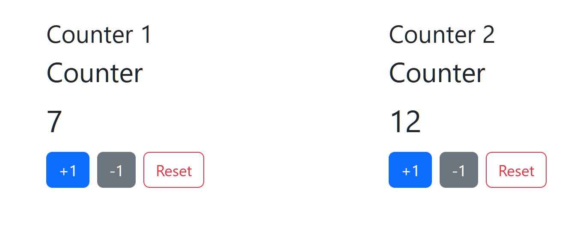

# Liveflux — Server-driven UI Components for Go

[](https://github.com/dracory/liveflux/actions/workflows/tests.yml)
[](https://goreportcard.com/report/github.com/dracory/liveflux)
[](https://pkg.go.dev/github.com/dracory/liveflux)

Liveflux is a server-driven component system for Go. It uses [`github.com/gouniverse/hb`](https://github.com/gouniverse/hb) internally for component tags, but it works with any server setup or frontend—responses are plain HTML and the client transport is framework-agnostic.

- Endpoint: your choice (example: `POST /liveflux`) (handler accepts `POST` and `GET`)
- Transport: built-in JS (any client that can POST/GET forms works)
- Rendering: `hb.TagInterface.ToHTML()` (internal detail). You can integrate with any templating/system since the handler returns HTML.
- State: In-memory by default via `MemoryStore` (swap with a session-backed store for production)

## Quick start

1) Register a component

```go
// internal/components/counter/counter.go
package counter

import (
    "context"
    "fmt"
    "net/url"

    "github.com/gouniverse/hb"
    "github.com/dracory/liveflux"
)

type Component struct { liveflux.Base; Count int }

func (c *Component) Mount(ctx context.Context, params map[string]string) error {
    c.Count = 0
    return nil
}

func (c *Component) Handle(ctx context.Context, action string, data url.Values) error {
    switch action {
    case "inc": c.Count++
    case "dec": c.Count--
    case "reset": c.Count = 0
    }
    return nil
}

func (c *Component) Render(ctx context.Context) hb.TagInterface {
    content := hb.Div()
    content = content.Child(hb.H2().Text("Counter"))
    content = content.Child(hb.Div().Style("font-size:2rem").Text(fmt.Sprintf("%d", c.Count)))
    content = content.Child(hb.Button().Text("+1").Attr("data-lw-action", "inc"))
    content = content.Child(hb.Button().Text("-1").Attr("data-lw-action", "dec"))
    content = content.Child(hb.Button().Text("Reset").Attr("data-lw-action", "reset"))
    
    // Wrap content with standard Liveflux root
    return c.Root(content)
}

// Register using an alias
func init() { liveflux.RegisterByAlias("counter", func() liveflux.ComponentInterface { return &Component{} }) }
```

2) Wire the endpoint

Create an HTTP route and attach the handler:

```go
// main.go (or your router setup)
package main

import (
    "net/http"
    "github.com/dracory/liveflux"
)

func main() {
    mux := http.NewServeMux()
    mux.Handle("/liveflux", liveflux.NewHandler(nil)) // nil -> uses default in-memory store
    http.ListenAndServe(":8080", mux)
}
```

3) Mount the component (Liveflux client)

Include the client script once in your layout and render a placeholder by alias. The client will auto-mount the component and handle actions.

```go
// In your base layout
layout = layout.Child(liveflux.Script())

// Where you want the component
ph := liveflux.PlaceholderByAlias("counter")
```

## Examples

### Counter (two instances side-by-side)

Run from repo root:

```bash
go run ./examples/counter
# or, with Task
task examples:counter:run
```

Screenshot:



Source: `examples/counter/`

## Package API

- Interface `liveflux.ComponentInterface`:
  - `GetID() string`, `SetID(id string)`
  - `Mount(ctx, params map[string]string) error`
  - `Handle(ctx, action string, data url.Values) error`
  - `Render(ctx) hb.TagInterface`
  - Provided by `liveflux.Base`:
    - `Root(content hb.TagInterface) hb.TagInterface` — returns the standard component root (`data-lw-root="1"`) and required hidden fields (`component`, `id`), with your content appended.
- Registry:
  - `liveflux.RegisterByAlias(alias string, ctor func() ComponentInterface)`
  - `liveflux.Register(ctor func() ComponentInterface)`
  - `liveflux.New(example ComponentInterface) (ComponentInterface, error)`
- Handler:
  - `liveflux.NewHandler(store Store)` → `http.Handler`
- Form fields (constants):
  - `component`, `id`, `action`

Constants exported by the package:

- `FormComponent = "component"`
- `FormID = "id"`
- `FormAction = "action"`

### SSR (server-side render) helpers

- `liveflux.SSR(c ComponentInterface, params ...map[string]string) hb.TagInterface`
- `liveflux.SSRHTML(c ComponentInterface, params ...map[string]string) string`

Use these to mount and render a component entirely on the server once (good for SEO) while still enabling the client runtime to hydrate later.

Example:

```go
// server-side
html := liveflux.SSRHTML(&counter.Component{}, map[string]string{"userID": "42"})
// write `html` into your page; include client JS to hydrate for actions
```

### Placeholders and client script

- `liveflux.PlaceholderByAlias(alias string, params ...map[string]string) hb.TagInterface`
- `liveflux.Placeholder(c ComponentInterface, params ...map[string]string) hb.TagInterface`
- `liveflux.JS(opts ...liveflux.ClientOptions) string` and `liveflux.Script(opts ...liveflux.ClientOptions) hb.TagInterface` return the client JS and accept optional configuration (e.g., endpoint, headers).

Include the client once per page (layout):

```go
// Using hb
layout = layout.Child(liveflux.Script())
// or: layout = layout.Child(hb.Script(liveflux.JS()))
// or configure a custom endpoint (e.g., behind /api/liveflux):
layout = layout.Child(liveflux.Script(liveflux.ClientOptions{Endpoint: "/api/liveflux"}))
```

#### Client configuration

You can configure the embedded client via Go helpers or by setting `window.__lw` before the script loads:

```go
// Go (hb) – full options
layout = layout.Child(liveflux.Script(liveflux.ClientOptions{
    Endpoint:    "/api/liveflux",
    Headers:     map[string]string{"X-CSRF-Token": token},
    Credentials: "same-origin", // or "include"
    TimeoutMs:   10000,
}))
```

Prefer the Go helper API; manual `window.__lw` configuration is typically unnecessary.

Mount via placeholder (built-in client auto-mounts on load):

```go
// Placeholder by alias; optional params become data attributes
ph := liveflux.PlaceholderByAlias("counter", map[string]string{"theme": "dark"})
// Renders: <div data-lw-mount="1" data-lw-component="counter" data-lw-param-theme="dark">Loading counter...</div>
```

Data attributes used by the client:

- `data-lw-mount="1"` — element to mount
- `data-lw-component="<alias>"` — registered alias
- `data-lw-param-<name>="<value>"` — initial params passed to `Mount`


## State store

Default: in-memory `MemoryStore` (process-local), exposed as `StoreDefault`. For multi-instance or restart-safe state, provide your own implementation of `liveflux.Store` (e.g., session-backed) and pass it to `liveflux.NewHandler(store)`.

Registry & aliases:

- `RegisterByAlias(alias string, ctor func() ComponentInterface)`
- `Register(ctor func() ComponentInterface)` — uses `GetAlias()` or derives via `DefaultAliasFromType`
- `New(example ComponentInterface)` — constructs a fresh instance using the example's alias/type

`DefaultAliasFromType` derives `<pkg>.<type-kebab>` or just `<pkg>` when names match.

Redirects:

- If a component calls `Base.Redirect(url, delaySeconds...)`, the handler sets custom redirect headers and writes a small HTML fallback that performs the redirect via `<script>` and `<noscript>` meta refresh.

## Production notes

- Validate inputs in `Handle`.
- Avoid storing secrets in component fields if using client-side state approaches.
- For larger UIs, split into nested components and mount them independently.
- Add CSRF as needed (HTMX posts are standard forms).

## License

This project is dual-licensed under the following terms:

- For non-commercial use, you may choose either the GNU Affero General Public License v3.0 (AGPLv3) _or_ a separate commercial license (see below). You can find a copy of the AGPLv3 at: https://www.gnu.org/licenses/agpl-3.0.txt

- For commercial use, a separate commercial license is required. Commercial licenses are available for various use cases. Please contact me via my [contact page](https://lesichkov.co.uk/contact) to obtain a commercial license.

## Similar projects

- Laravel Livewire (PHP): https://livewire.laravel.com [Comparison](comparisons/php_livewire_comparison.md)
- Phoenix LiveView (Elixir): https://hexdocs.pm/phoenix_live_view [Comparison](comparisons/phoenix_liveview_comparison.md)
- Hotwire Turbo (Rails): https://turbo.hotwired.dev [Comparison](comparisons/hotwire_turbo_comparison.md)
- StimulusReflex (Ruby): https://docs.stimulusreflex.com [Comparison](comparisons/stimulusreflex_comparison.md)
- Inertia.js (multi-framework): https://inertiajs.com
- Blazor (C#/.NET): https://dotnet.microsoft.com/apps/aspnet/web-apps/blazor [Comparison](comparisons/blazor_comparison.md)
