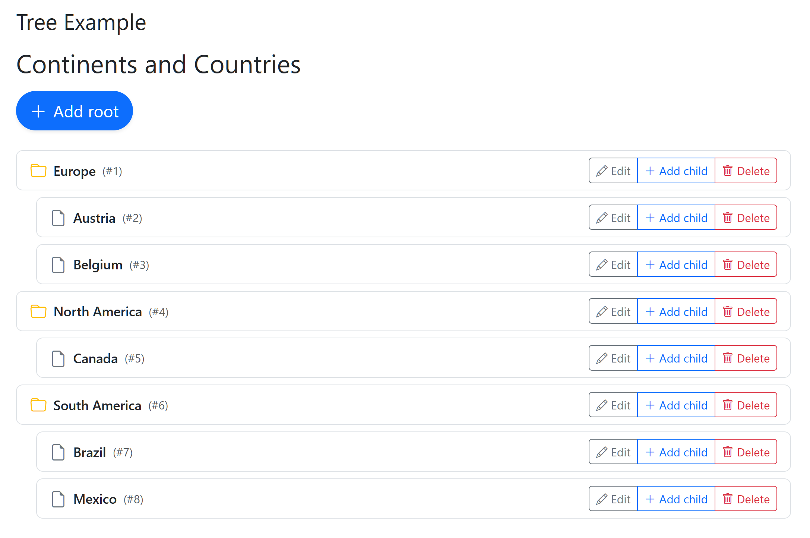
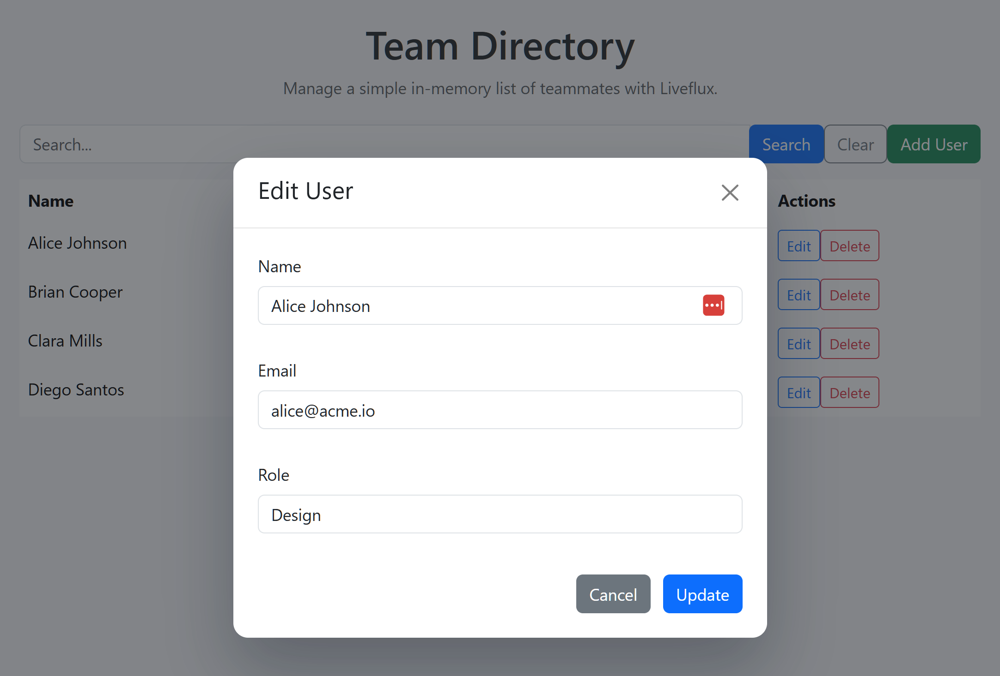

# Liveflux — Server-driven UI Components for Go

[](https://github.com/dracory/liveflux/actions/workflows/tests.yml)
[](https://goreportcard.com/report/github.com/dracory/liveflux)
[](https://pkg.go.dev/github.com/dracory/liveflux)

Liveflux is a server-driven component system for Go. It uses [`github.com/dracory/hb`](https://github.com/dracory/hb) for HTML generation but works with any server or frontend—the transport is plain HTML over HTTP or WebSocket.

## Highlights

- **Server-first rendering**: Components run on the server, returning HTML for any client.
- **Lightweight runtime**: Bundled JS handles mounts, actions, redirects, and optional WebSockets.
- **Composable state**: Per-component state persists via pluggable stores (`MemoryStore` by default).
- **Event-driven UX**: Dispatch server events and respond via Go or JavaScript listeners.
- **Transport flexibility**: Use standard HTTP POST/GET or upgrade seamlessly to WebSockets.
- **Declarative triggers**: Bind DOM events to actions with `data-flux-trigger` for live search, auto-save, and validation without custom JavaScript.
- **Form-less submission**: Collect fields from anywhere in the DOM using `data-flux-include` and `data-flux-exclude`.
- **Targeted updates**: Update only specific DOM regions instead of full component re-renders for better performance.

## Quick start

- Install: `go get github.com/dracory/liveflux`
- Register a component and embed `liveflux.Base`
- Mount the handler at `/liveflux`
- Include `liveflux.Script()` and use `liveflux.PlaceholderByAlias()` or `liveflux.SSR()`

### Serving the client script endpoint

`liveflux.NewHandler` also responds to `GET` requests by returning the embedded client runtime. Mount the handler where you want to serve both HTML updates and the script:

```go
mux := http.NewServeMux()
handler := liveflux.NewHandler(nil)
mux.Handle("/liveflux", handler)
```

Then include the JS by reference from your layout:

```html
<script src="/liveflux" defer></script>
```

If you prefer to inline the script instead, call `liveflux.Script()` (see `docs/getting_started.md`).

## Examples

Full walkthroughs live in `docs/getting_started.md` and `docs/components.md`.

### Counter (two instances side-by-side)

Run from repo root:

```bash
go run ./examples/counter
# or, with Task
task examples:counter:run
```

Screenshot:


Source: `examples/counter/`

### Tree (nested list with modal add/edit)

Run from repo root:

```bash
go run ./examples/tree
# or, with Task
task examples:tree:run
```

Screenshots:




Source: `examples/tree/`

### Events (server-dispatched listeners)

Run from repo root:

```bash
go run ./examples/events
# or, with Task
task examples:events:run
```

What it shows:

- Post creation dispatches a `post-created` event with metadata.
- `PostList` automatically registers `OnPostCreated` and updates its state.
- Client runtime mirrors events to JS via `$wire.on()` or `liveflux.on()`.

Source: `examples/events/`

### CRUD (modals + list with events)

Run from repo root:

```bash
go run ./examples/crud
# or, with Task
task examples:crud:run
```

Screenshots:





Source: `examples/crud/`

### WebSocket Counter (two instances)

Run from repo root:

```bash
go run ./examples/websocket
# or, with Task
task examples:websocket:run
```

Screenshot:


Source: `examples/websocket/`

### Form-less Submission (flexible field collection)

Run from repo root:

```bash
go run ./examples/formless
# or, with Task
task examples:formless:run
```

What it shows:

- Shared filters across multiple components using `data-flux-include`.
- Multi-step forms collecting fields from multiple DOM sections.
- Excluding sensitive fields with `data-flux-exclude`.
- Progressive enhancement without requiring `<form>` wrappers.

Source: `examples/formless/`

### Targeted Updates (selective DOM updates)

Run from repo root:

```bash
go run ./examples/target
# or, with Task
task examples:target:run
```

What it shows:

- Implementing `TargetRenderer` to return only changed fragments.
- Marking targets dirty with `MarkTargetDirty()`.
- Independent updates for multiple components and document-scoped elements (see [Targeted updates guide](docs/targeted_updates.md#document-scoped-fragments-global-selectors)).
- 80-95% reduction in network payload for large components.
- Preserving client state (focus, scroll, media playback).

Source: `examples/target/`

### Triggers (live search with debouncing)

Run from repo root:

```bash
go run ./examples/triggers
# or, with Task
task examples:triggers:run
```

What it shows:

- Declarative event handling with `data-flux-trigger`.
- Live search with automatic debouncing using `keyup changed delay:300ms`.
- No custom JavaScript required for interactive features.
- Built-in change detection prevents redundant requests.

Source: `examples/triggers/`

## Documentation

Start with the focused guides under `docs/`:

- [Overview](docs/overview.md)
- [Getting started](docs/getting_started.md)
- [Components](docs/components.md)
- [Architecture](docs/architecture.md)
- [Events](docs/events.md)
- [Handler & transport](docs/handler_and_transport.md)
- [State management](docs/state_management.md)
- [SSR](docs/ssr.md)
- [WebSocket integration](docs/websocket.md)
- [Triggers](docs/triggers.md)
- [Targeted updates](docs/targeted_updates.md)

## Package API

- **Components**: `ComponentInterface`, `Base`, and registry helpers (`Register`, `RegisterByAlias`, `New`). See `docs/components.md` and `docs/architecture.md`.
- **Handlers**: HTTP + WebSocket entry points (`NewHandler`, `NewHandlerWS`, `NewWebSocketHandler`). See `docs/handler_and_transport.md` and `docs/websocket.md`.
- **SSR helpers**: `SSR`, `SSRHTML` for first render hydration. See `docs/ssr.md`.
- **Stores**: `Store` interface with default `MemoryStore`. See `docs/state_management.md` for custom implementations.

## Production notes

- Validate inputs in `Handle` and sanitize client data.
- Use session-backed or distributed stores in multi-instance deployments.
- Configure CSRF and allowed origins for HTTP/WebSocket endpoints.
- Decompose large views into smaller Liveflux components.

## License

This project is dual-licensed under the following terms:

- For non-commercial use, you may choose either the GNU Affero General Public License v3.0 (AGPLv3) _or_ a separate commercial license (see below). You can find a copy of the AGPLv3 at: https://www.gnu.org/licenses/agpl-3.0.txt

- For commercial use, a separate commercial license is required. Commercial licenses are available for various use cases. Please contact me via my [contact page](https://lesichkov.co.uk/contact) to obtain a commercial license.

## Similar projects

- Laravel Livewire (PHP): https://livewire.laravel.com [Comparison](docs/comparisons/php_livewire_comparison.md)
- Phoenix LiveView (Elixir): https://hexdocs.pm/phoenix_live_view [Comparison](docs/comparisons/phoenix_liveview_comparison.md)
- Hotwire Turbo (Rails): https://turbo.hotwired.dev [Comparison](docs/comparisons/hotwire_turbo_comparison.md)
- StimulusReflex (Ruby): https://docs.stimulusreflex.com [Comparison](docs/comparisons/stimulusreflex_comparison.md)
- Inertia.js (multi-framework): https://inertiajs.com
- Blazor (C#/.NET): https://dotnet.microsoft.com/apps/aspnet/web-apps/blazor [Comparison](docs/comparisons/blazor_comparison.md)
