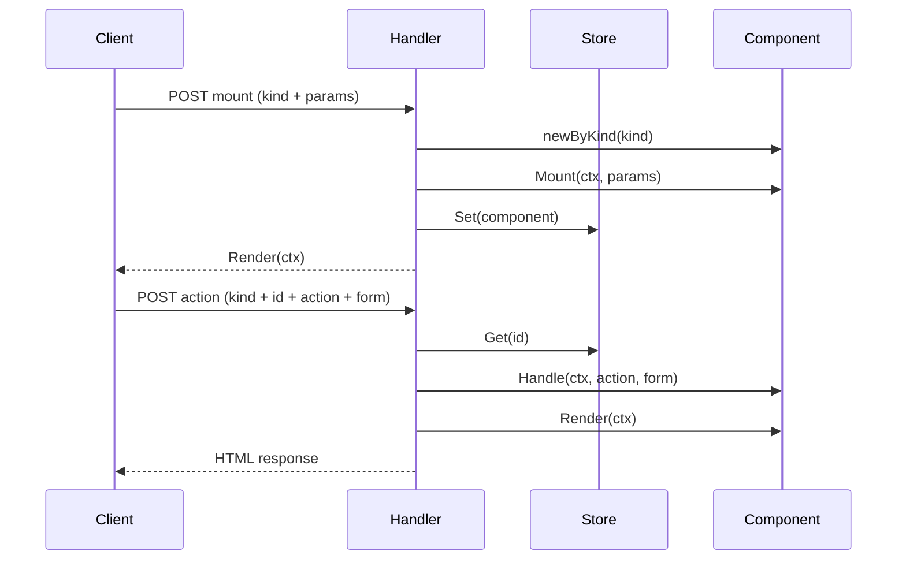

# Architecture

Liveflux combines server-driven components with a lightweight client runtime. The framework is implemented entirely in Go, relying on the standard library and a small set of helpers. This guide breaks down the major pieces and how they coordinate.

## High-Level Flow

1. A client (browser) renders HTML containing Liveflux placeholders (`data-flux-mount="1"`).
2. The Liveflux client script scans the DOM, posts mount requests to the server (`/liveflux` by default), and swaps the placeholder with returned markup.
3. User interactions trigger form submissions (or WebSocket messages) carrying the component kind, ID, action, and form data.
4. The server handler rehydrates the component from the store, executes `Handle`, and re-renders HTML. The client patches the DOM with the response.

## Core Packages

- `component.go`: Defines `ComponentInterface` and the `Base` struct. Encapsulates lifecycle concepts and redirect helpers.
- `registry.go`: Tracks kinds mapped to component prototypes for runtime instantiation.
- `handler.go`: HTTP entry point that mounts components, dispatches actions, writes HTML, and handles redirects.
- `websocket.go`: Optional WebSocket layer providing bi-directional updates and broadcast utilities.
- `state.go`: Store abstraction and default in-memory implementation.
- `script.go`: Bundles client-side JavaScript and configuration helper structures.
- `ssr.go`: Server-side rendering helpers to pre-render components.
- `placeholder.go`: Renders mount placeholders for use in templates.

## Component Lifecycle Diagram

## Request Handling Pipeline (`handler.go`)

- Responds to `GET` requests by writing the bundled client script (`script.go`).
- Parses forms (`ParseForm`) to read `FormComponent`, `FormID`, `FormAction`.
- If `FormID` is empty, calls `mount()` to create a new instance via `newByKind` from `registry.go`.
- On successful mount, stores the instance in the configured `Store` and returns rendered HTML.
- For actions, fetches the instance from the store, executes `Handle`, persists, checks for redirects, and returns the updated markup.
- Redirects use custom headers (`RedirectHeader`, `RedirectAfterHeader`) and fallback HTML generated by `buildRedirectFallbackHTML`.

## State Management (`state.go`)

The default `MemoryStore` keeps components in-process using a `sync.RWMutex`-protected map. Implement `Store` when you need persistence across processes or deployments. Handlers interact with the store using `Get`, `Set`, and `Delete` by component ID.

## WebSocket Integration (`websocket.go`)

`NewWebSocketHandler` wraps `Handler` to support upgrades. It maintains per-component connection sets to handle broadcasts and direct responses. Components that implement `WebSocketComponent` can process messages via `HandleWS` for richer real-time behavior.

## Client Runtime (`js/*.js`)

The embedded JavaScript modules perform the following:

- Discover placeholders and issue initial mount requests.
- Submit actions with form data, including hidden inputs generated by `Base.Root()`.
- Collect fields from arbitrary DOM elements using `data-flux-include` and `data-flux-exclude` attributes.
- Manage redirect responses by inspecting `RedirectHeader` and `RedirectAfterHeader`.
- Optionally establish WebSocket connections, falling back to HTTP automatically.

`script.go` concatenates these modules and exposes configuration through `ClientOptions` (endpoint, headers, WebSocket URL, credentials, timeout, redirect header names).

### Form-less Submission

The client supports flexible field collection via `data-flux-include` and `data-flux-exclude` attributes:

- `data-flux-include`: CSS selectors (comma-separated) specifying elements to serialize
- `data-flux-exclude`: CSS selectors (comma-separated) specifying fields to omit from included scopes

This enables components to collect data from anywhere in the DOM without requiring traditional `<form>` wrappers. See `docs/handler_and_transport.md` for detailed usage.

## SSR Workflow (`ssr.go`)

`SSR()` and `SSRHTML()` allow components to be mounted server-side before the first request. They ensure kind and ID are set, call `Mount`, persist in `StoreDefault`, and render HTML. When the client later mounts, it reuses the stored state.

## Error Handling and Logging

- `handler.go` writes status codes and plain-text messages for validation errors, mount/handle failures, or missing components.
- Errors are logged with `log.Printf`. Customize logging by wrapping the handler or using middleware.

## Extensibility Points

- **Stores**: Implement custom persistence (session, Redis, database).
- **Handlers**: Wrap `NewHandler` or `NewHandlerWS` with middleware for auth, logging, etc.
- **Client options**: Provide custom headers, credentials, or WebSocket endpoints.
- **Message validation**: Use `WithWebSocketMessageValidator` to enforce server-side rules.
- **Redirect policies**: Inspect `RedirectHeader` and `RedirectAfterHeader` in the client for cross-frame navigation or notifications.
