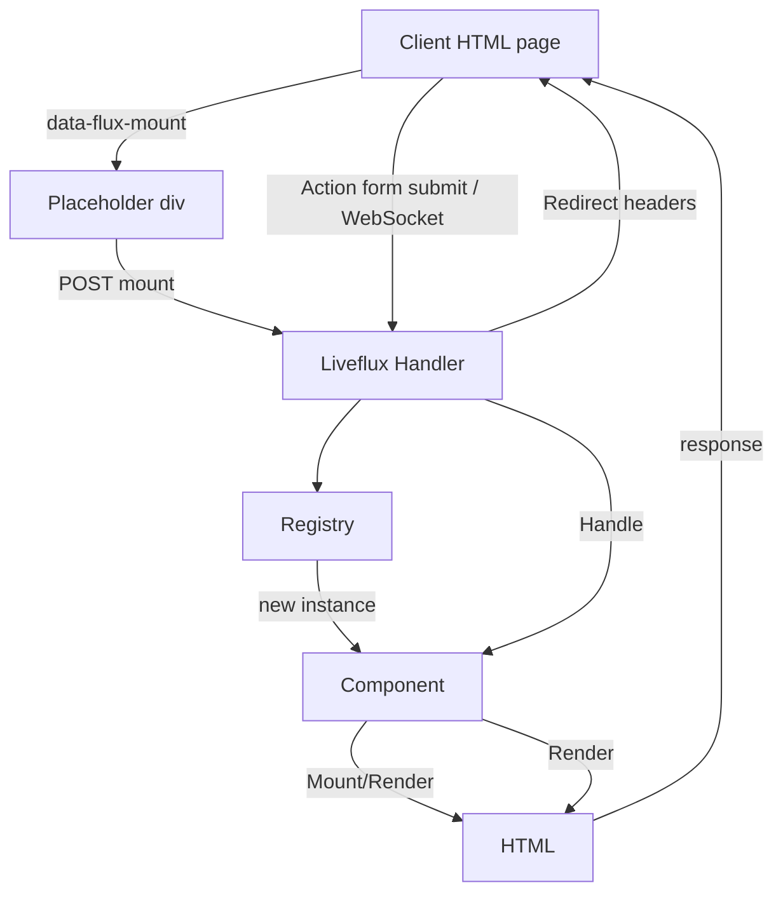

# Liveflux Overview

Liveflux is a server-driven UI framework for Go that renders HTML on the server and delivers a lightweight client to handle user interactions. Components live entirely in Go, with state persisted on the server. The client submits form posts or WebSocket messages and replaces component markup with the server response.

## Key Concepts

- **Components**: Go structs implementing `liveflux.ComponentInterface`, with lifecycle methods `Mount`, `Handle`, and `Render`.
- **Base mixin**: `liveflux.Base` embeds alias/ID tracking, redirect helpers, and `Root()` markup wrapper.
- **Transport**: HTTP POST/GET via `liveflux.NewHandler()`; optional WebSocket transport via `liveflux.NewHandlerWS()`.
- **State store**: `liveflux.Store` persists component instances between requests. Default is in-memory; swap with a custom implementation for multi-instance deployments.
- **Client runtime**: Embedded JavaScript served by `liveflux.Script()` manages mounting, action submission, redirects, and optional WebSocket connections.
- **Server-side rendering (SSR)**: `liveflux.SSR()` and `liveflux.SSRHTML()` render components once on the server while keeping them interactive after hydration.

## Architecture Diagram

## Directory Layout

- `component.go`: component interface and base implementation.
- `handler.go`: HTTP entry point and request lifecycle.
- `websocket.go`: optional WebSocket transport layer.
- `state.go`: store interface and default implementation.
- `script.go`: embedded client runtime helpers.
- `ssr.go`: server-side rendering helpers.
- `examples/`: runnable samples illustrating usage.
- `docs/`: guides and references (this directory).

## When to Use Liveflux

- Prefer Go-generated HTML with progressive enhancement.
- Need server-driven UI updates without adopting a front-end framework.
- Want fine-grained components with per-instance state on the server.
- Require seamless WebSocket upgrades for low-latency updates while maintaining HTTP fallback.

## Ecosystem Integrations

- **Templating**: Components use [`github.com/dracory/hb`](https://github.com/dracory/hb) by default but can return any type implementing `hb.TagInterface`.
- **HTTP servers**: Works with `net/http`, chi, echo, fiber, etc.—Liveflux exposes standard `http.Handler`s.
- **Clients**: Bundled JS works with any rendering system serving the script tag and placeholders.

Continue with the focused guides in this directory for detailed instructions on building components, handling state, SSR, WebSockets, and client configuration.
