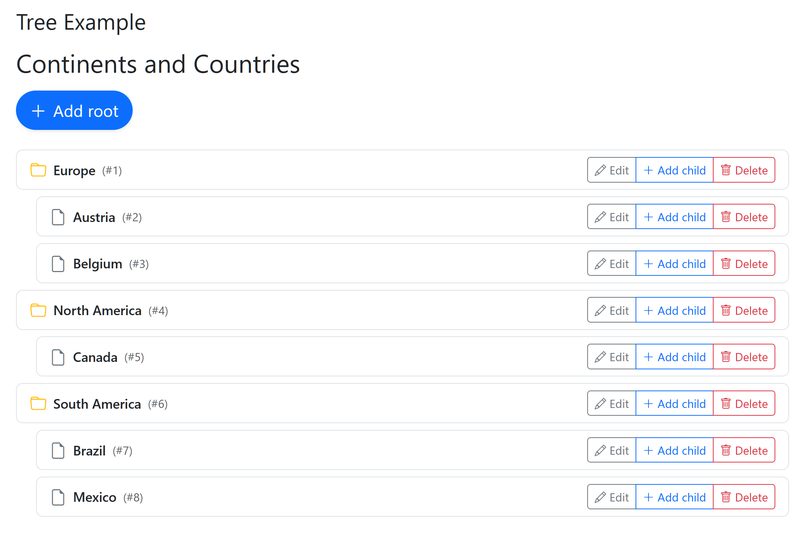
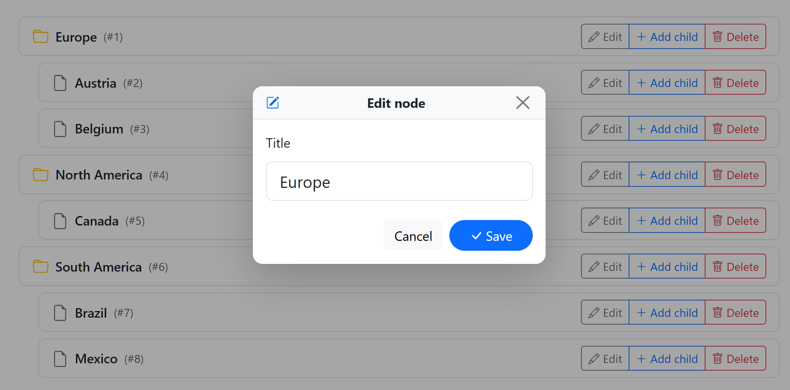
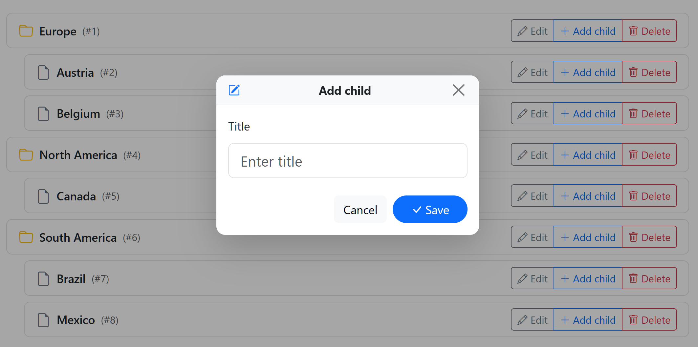

# Liveflux Tree Example

A runnable example demonstrating a simple interactive tree component with:

- Add root nodes
- Add child nodes to any node
- Delete any node (subtree is removed)

## Run

```bash
# from the liveflux repo root
go run ./examples/tree
```

Then open http://localhost:8080

## Screenshots







## What it does
- Renders a server-side Tree using `liveflux.SSR`
- Uses forms and `data-flux-action` to send actions: `add_root`, `add_child`, `delete`
- Mounts the JS runtime via `liveflux.Script()` and posts to `/liveflux`

## Notes
- The component wraps markup with `t.Root(content)` (from `liveflux.Base`) which includes required hidden fields.
- Inputs are serialized from the nearest `<form>` for each button, per the client runtime in `js/handlers.js`.
